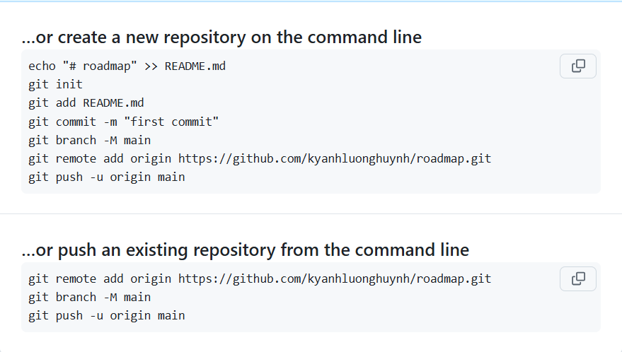
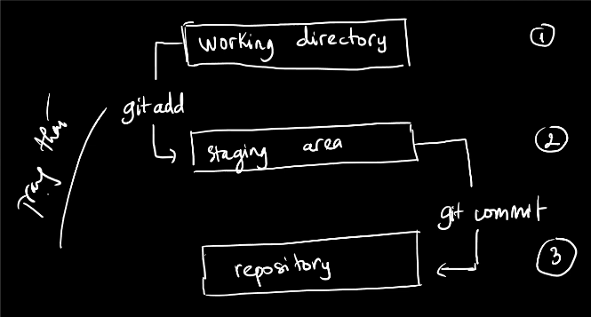

# Bài học vở lòng: Sử dụng GIT và Format file MARKDOWN.

Ok thì đơn giản thôi, git nó là một nơi để em lưu trữ các đoạn mã/ hình ảnh/ ... của em trong quá trình lập trình.

Thì đầu tiên em cần là tạo 1 repository, em có thể bao nhiều repository cũng được tùy ý, thông thường thì tùy project, họ sẽ tạo 1 repository khác nhau. Xong rồi điều chỉnh phạm vi access của nó là public hoặc private, public thì ai cũng xem được, private thì chỉ có người em cho phép xem được thôi. Này em sẽ mày mò riêng.

---

Thông thường thì khi em tạo 1 repository mới tinh nó sẽ có cái hướng dẫn này, em có thể lưu lại để đọc.


Terminal là nơi em gõ dòng lệnh, lý thuyết của nó thì em google nha. Giờ anh sẽ thử thực hiện theo docs.

---
Step 1: Init (khởi tạo) cho folder của em có chứa git.

```shell
git init
```

Step 2: Liên kết folder ở máy em, với git repository ở trên mạng

```shell
git remote add origin https://github.com/kyanhluonghuynh/roadmap.git
```

Step 3: Tạo 1 branch để push lên, thông thường sẽ là main.

Step 4: Thêm file mà mình cần đẩy lên trên git. Xài git add <ten file> để thêm nó vào, hoặc git add . để thêm toàn bộ.

Step 5: Em cần phải commit (Tức là tạo 1 message cho action của em)

Step 6: Sau đó em cần đẩy nó lên trên git của em. Thường họ sẽ xài


Đó là xong thui.

Khi em thay đổi gì thì nó cũng sẽ có thay đổi file của em. Mấy này em sẽ tìm hiểu từ từ.


Thử thay đổi một dòng trong file này và upload nên trên git.

